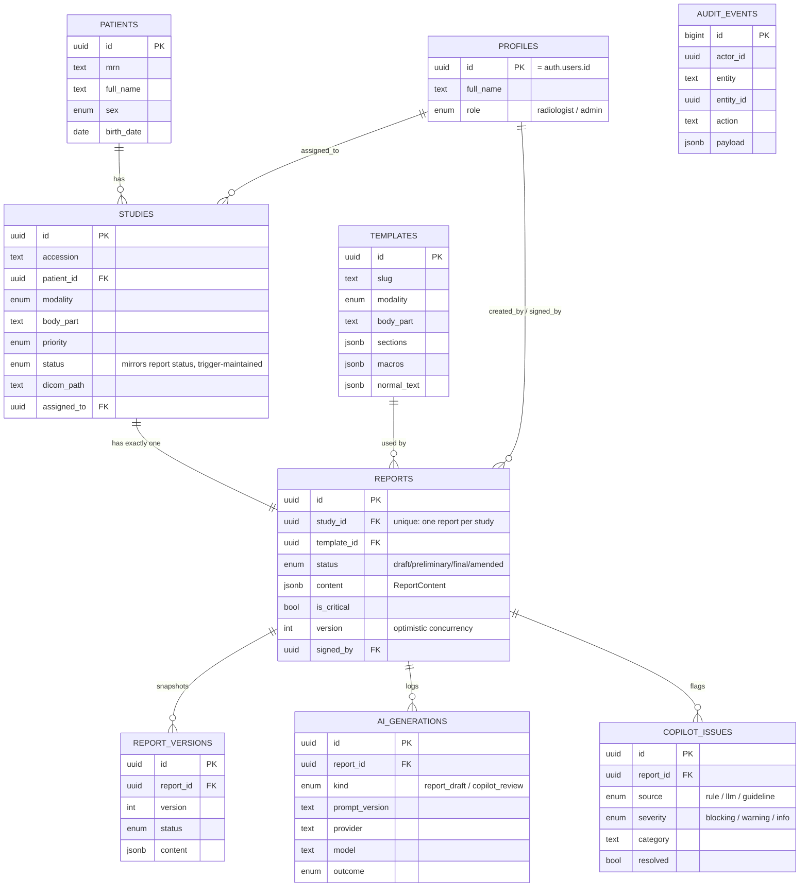
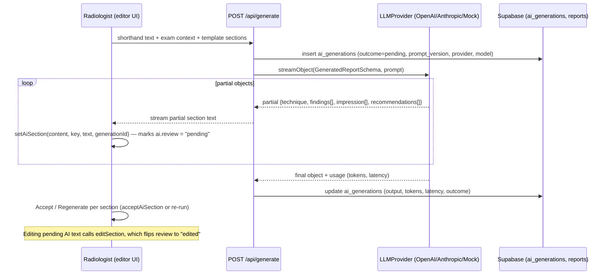
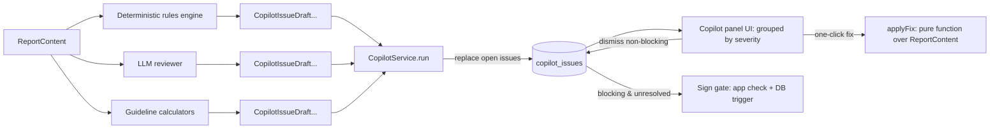
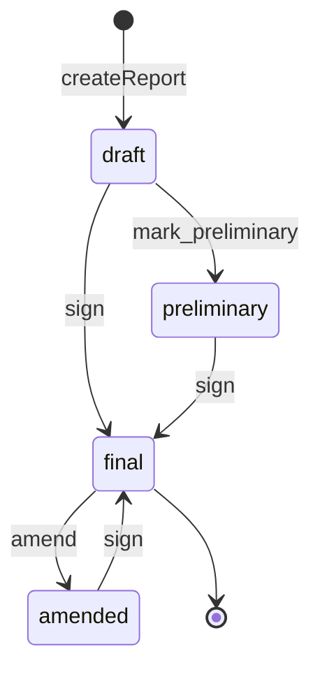
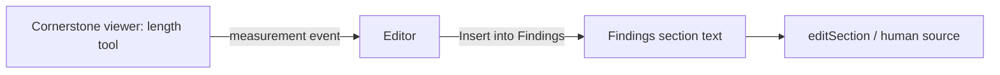
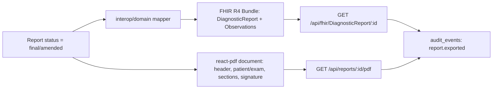

# Architecture

RadPilot is a **modular monolith**: one Next.js 16 app and one Postgres database
(Supabase), split into modules with enforced boundaries, rather than a single
undifferentiated codebase or a premature microservice split. This document covers the
module structure, the public entry points and how ESLint enforces them, the data model,
the invariants the database enforces (not just the app), and the key flows.

## Why a modular monolith

See `docs/adr/0001-modular-monolith.md` for the full reasoning. In short: this is a
single team shipping one product end to end, so network-boundary costs (serialization,
partial failure, versioning, distributed transactions) would be pure overhead; but the
codebase still needs the discipline a hard module boundary provides, so module
boundaries are enforced in-process by linting instead of by a service mesh.

## The four layers

Every module (`src/modules/<name>/`) has the same four directories:

```
src/modules/<name>/
├── domain/           pure business rules: zod schemas, types, pure functions
├── application/       use cases, orchestrating domain + infrastructure ports
├── infrastructure/     adapters: Supabase repositories, AI SDK clients, row mappers
└── ui/                 React components
```

- **`domain/`** has no framework dependencies at all — not even Next.js, Supabase, React
  or the AI SDK. This is what makes it unit-testable without mocks and reusable from
  any adapter (server, client, a future worker, an eval script). It's where
  `ReportContent`, the report status machine, `CopilotRule`, `GeneratedReportSchema`,
  etc. live.
- **`application/`** holds use cases (`listWorklist`, `signReport`, `generateDraft`,
  …) written against ports (interfaces) like `StudyRepository` or `LLMProvider`, so they
  can be tested with an in-memory fake and swapped onto a real adapter in production.
- **`infrastructure/`** implements those ports against real systems: Supabase queries,
  row-to-domain mappers (snake_case → the zod schemas in `domain/`), the OpenAI/
  Anthropic/Mock AI adapters, Cornerstone loaders, `@react-pdf/renderer`.
- **`ui/`** is React components (Server and Client) specific to that module —
  the worklist table, the Tiptap editor, the copilot panel, the viewer.

## Public entry points and the ESLint rules that enforce them

A module is reached only through three entry points, each a barrel file
(`src/modules/<name>/index.ts`, `server.ts`, `ui/index.ts` in practice):

| Entry point | Exposes | Allowed from |
|---|---|---|
| `@/modules/<name>` | domain types, zod schemas, pure functions | anywhere (client or server) |
| `@/modules/<name>/server` | application use cases wired to infrastructure | server only |
| `@/modules/<name>/ui` | React components | anywhere components render |

Inside a module, code uses relative imports; across modules, only these three paths are
allowed. This is enforced by `eslint.config.mjs`
(`/Users/marcus/Documents/radpilot/.claude/worktrees/agent-a195125b18674863e/eslint.config.mjs`),
not by convention alone:

```js
// eslint.config.mjs:10-22 — reaching into another module's internals is an error
const moduleInternals = {
  group: [
    "@/modules/*/domain", "@/modules/*/domain/**",
    "@/modules/*/application", "@/modules/*/application/**",
    "@/modules/*/infrastructure", "@/modules/*/infrastructure/**",
    "@/modules/*/ui/**",
  ],
  message: "Import another module through its public entry point: ...",
};
```

applied to every file under `src/**/*.{ts,tsx}` via `no-restricted-imports`. A second,
stricter rule applies only inside `src/modules/*/domain/**`:

```js
// eslint.config.mjs:26-44
const domainForbidden = {
  group: [
    "react", "react-dom", "next", "next/**", "@supabase/**", "ai", "@ai-sdk/**",
    "@tiptap/**", "@cornerstonejs/**", "@react-pdf/**", "@/lib/**", "@/components/**",
    "@/modules/*/server", "@/modules/*/ui",
  ],
  message: "domain/ must stay framework-free: only zod, plain TypeScript and other modules' domain entry points.",
};
```

So `domain/` can depend on another module's `domain/` (e.g. `reports/domain` imports
`SECTION_KEYS` from `@/modules/templates`), but never on `server`/`ui`, React, Next,
Supabase, the AI SDK, Tiptap, Cornerstone or PDF rendering. This is what keeps domain
logic (the report lifecycle, copilot rules, guideline math) testable in plain Vitest
with zero mocking and portable if the framework ever changes.

## Module map

| Module | Owns | Track |
|---|---|---|
| `studies` | Patient, Study, WorklistItem, modality/body-part/priority/status enums, worklist ordering, claim/release | A |
| `templates` | Template, TemplateSection, Macro, section schema, template selection, macro lookup | B |
| `reports` | ReportContent (canonical content model), Report, ReportVersion, status machine, editor (Tiptap), streaming generation glue, sign/amend lifecycle | B (editor) + C (lifecycle) |
| `ai` | GeneratedReportSchema, AiGeneration, LLMProvider port, OpenAI/Anthropic/Mock adapters, prompt registry | B |
| `copilot` | CopilotIssue, CopilotRule, RuleContext, rules engine, LLM review integration, copilot panel UI | C |
| `guidelines` | Fleischner, BI-RADS, TI-RADS, LI-RADS calculators (pure) | C |
| `interop` | FHIR R4 mapper, PDF export | D |
| `viewer` | DICOM loading and display (Cornerstone), window/level, measurement tools | D |
| `audit` | AuditEvent, AuditAction, AuditEntity (append-only log read/write helpers) | C |

`src/lib/` is shared, cross-cutting infrastructure every module may use: `env.ts`
(zod-validated env, client vars read via literal `process.env.X` so Next.js can inline
them, server vars validated lazily via `getServerEnv()`), `supabase/{client,server,admin}.ts`
(three Supabase clients — anon/browser, server-component/SSR, service-role/admin), and
`logger.ts` (structured logging that never carries PHI — ids only, see
`docs/adr/0004-phi-policy.md`).

## Data model



Tables live in `supabase/migrations/20261001000000_init_schema.sql`; types in Postgres
mirror the zod enums in `src/modules/*/domain` 1:1 (e.g. `public.report_status` ↔
`ReportStatusSchema`). `src/lib/supabase/database.types.ts` is generated from the live
schema (`npm run db:types`) and consumed via `Tables<"studies">`, `TablesInsert<...>`,
`Enums<...>`; row mappers in each module's `infrastructure/mappers.ts` turn snake_case
rows into zod-parsed domain objects (throwing `RowMappingError` if a row doesn't match
its schema — a cheap, early fail-safe against schema drift).

## DB-enforced invariants

RadPilot treats the database as the **last line of defense**, not just a passive store
— see `docs/adr/0006-db-enforced-invariants.md` for the rationale. The app layer
re-implements the same checks for friendly error messages, but every one of these is
also enforced unconditionally in SQL, so a bug in a use case, a forgotten check in a new
code path, or a direct psql session cannot violate them:

- **Status transitions follow the lifecycle graph.** `reports_before_update`
  (`supabase/migrations/20261001000000_init_schema.sql:256`) whitelists exactly the
  pairs in `REPORT_TRANSITIONS` (`src/modules/reports/domain/status.ts:16`): `draft →
  preliminary`, `draft → final`, `preliminary → final`, `final → amended`, `amended →
  final`. Any other transition raises `check_violation`.
- **A final report's content is locked until amended.** The same trigger rejects a
  `content`/`template_id`/`is_critical` change when `old.status = 'final'`.
- **Signing is blocked by pending AI text or open blocking copilot issues**, checked
  with `jsonb_path_exists(new.content, '$.sections.* ? (@.ai.review == "pending")')` and
  an `exists` query against `copilot_issues` — in the trigger itself, so the gate
  applies no matter which code path updates the row.
- **Signing works only in your own name.** RLS policy `"reports: edit, and sign only in
  your own name"` (`supabase/migrations/20261001000100_rls.sql:100`) requires
  `signed_by = auth.uid()` whenever `status = 'final'`.
- **`reports.version` bumps on every update** (`new.version := old.version + 1` in the
  same trigger), which is what makes `update ... where id = $1 and version = $2`
  (optimistic concurrency) reliable.
- **Every insert and status change writes history.** `reports_write_history`
  (`AFTER INSERT` and `AFTER UPDATE OF status`) is `SECURITY DEFINER` and writes both
  `report_versions` and `audit_events`; clients hold no grant to write
  `report_versions` directly at all.
- **`studies.status` mirrors the report status.** `reports_sync_study_status` updates
  the study row whenever a report is inserted or its status changes; clients can only
  change `studies.assigned_to` (column-level grant,
  `supabase/migrations/20261001000100_rls.sql:60`).
- **`audit_events` is append-only.** `prevent_mutation()` raises on any `UPDATE`/`DELETE`
  (also applied to `report_versions`).

## Key flows

### Streaming report generation



Prompt construction is versioned
(`src/modules/ai/application/prompts/report-draft.v1.ts`) and takes the template
sections, exam context (modality, body part, indication, patient sex/age) and the
shorthand as input — never free-form chat history — which is what keeps the Mock
adapter deterministic and the prompt diffable across versions. Prompt text itself is
never passed to `logger` (see `docs/adr/0004-phi-policy.md`); only ids, the provider,
model, token counts and latency are logged.

### Hybrid copilot review



Each deterministic rule (`CopilotRule`, `src/modules/copilot/domain/issue.ts:79`) is a
pure function of `RuleContext` (content + study + patient, no I/O) — e.g.
`laterality-conflict`, `sex-mismatch`, `finding-missing-from-impression`,
`critical-finding`, `measurement-units`, and a guideline-suggestion rule that turns a
detected nodule into a Fleischner-cited `SuggestedFix` with `kind: "append"`. The LLM
reviewer implements a parallel, non-deterministic pass (`reviewReport`) for issues rules
can't enumerate in advance; the Mock provider returns none, keeping tests and the
offline demo deterministic. A re-run **replaces open issues** and keeps resolved ones as
history (RLS policy `"copilot_issues: delete open issues"` only allows deleting
unresolved rows).

### Report lifecycle (sign / amend)



`nextStatus(from, action)` (`src/modules/reports/domain/status.ts:29`) is the
single source of truth the app consults before attempting a transition;
`reports_before_update` is the same graph enforced in SQL. `signReport` additionally
runs `missingRequiredSections`, `pendingAiSections` and an open-blocking-issues check
up front so the UI can show a specific, friendly reason rather than a raw Postgres
error — but even if that app-level check is skipped or buggy, the DB trigger still
blocks the write.

### Viewer → report



The viewer (Track D) loads a series from the private `dicom` bucket via signed URLs,
using `manifest.json` to get the instances in reading order. It emits a typed event
(e.g. `{ text: "8 mm, series 3 image 42" }`) on "Insert into Findings"; the editor
appends that text into the Findings section as ordinary human-sourced content — there
is no special "measurement" type in `ReportContent`, keeping the content model (and
downstream FHIR/PDF export) simple.

### Export (FHIR / PDF)



Both exporters read only the canonical `ReportContent` (`sectionItems` for
findings/impression as discrete Observations; the full section text for the PDF), so
neither depends on Tiptap's document format — see
`docs/adr/0005-report-content-model.md`. Export is only permitted for `final`/`amended`
reports (checked in the route handler, mirroring the fact that a `draft`/`preliminary`
report has no FHIR `DiagnosticReport.status` equivalent worth publishing), and every
export records a `report.exported` audit event.
